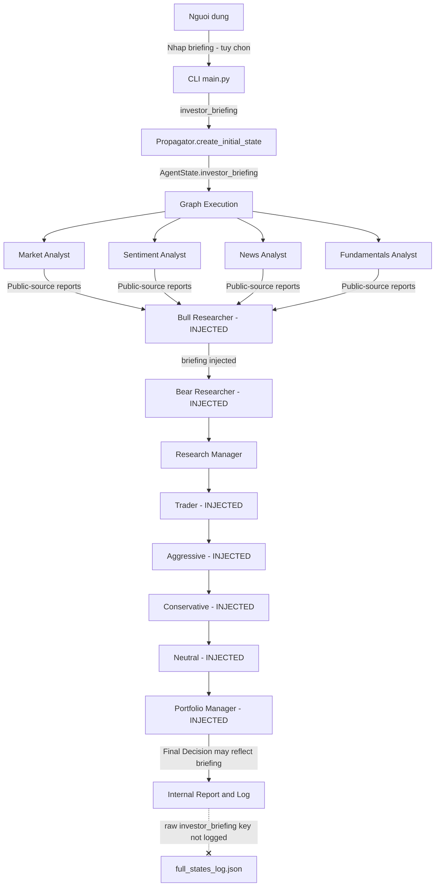

# Kế Hoạch: Luồng Investor Briefing (Thông Tin Bổ Sung Tùy Chọn)

## 1. Vấn Đề

Hiện tại, mỗi agent trong pipeline có system prompt cố định và chỉ nhận dữ liệu từ
các nguồn công khai (yfinance, Alpha Vantage, Binance, Reddit, v.v.). Trong thực tế
đầu tư, nhà đầu tư thường có thêm:

1. **Luận điểm / ghi chú riêng** — thesis đầu tư, giả định, thông tin bổ sung,
   hoặc research nội bộ mà người dùng có quyền sử dụng.
2. **Vị thế hiện tại** — nhà đầu tư đang nắm giữ bao nhiêu cổ phiếu/crypto, giá vốn
   trung bình, lãi/lỗ chưa thực hiện, tỷ trọng danh mục, và ràng buộc rủi ro riêng.
3. **Ràng buộc & mục tiêu** — mục tiêu chốt lời, stop-loss, giới hạn tỷ trọng,
   thời gian nắm giữ, hoặc yêu cầu quản trị danh mục.

Những thông tin này ảnh hưởng trực tiếp đến quyết định nhưng không có cách nào đưa vào
pipeline hiện tại.

## 2. Giải Pháp: Trường `investor_briefing` Tùy Chọn

Thêm một luồng **tùy chọn** (opt-in) cho phép người dùng cung cấp "Investor Briefing"
trước khi chạy phân tích. Briefing này được inject vào `AgentState` và truyền xuống
các agent cần thiết — **không thay đổi hành vi mặc định** khi người dùng không cung cấp.

### Nguyên tắc thiết kế

- **Opt-in, không bắt buộc**: Khi briefing trống, toàn bộ pipeline chạy y như cũ.
- **Không thay đổi graph topology**: Không thêm node mới, chỉ thêm trường state.
- **Surgical injection**: Chỉ inject vào prompt của các agent thực sự cần (researchers,
  risk debators, trader, portfolio manager). Các analyst thu thập dữ liệu công khai
  không bị ảnh hưởng.
- **Báo cáo nội bộ**: Đây là tài liệu lưu hành nội bộ, nên briefing được phép ảnh
  hưởng đến lập luận và được phép xuất hiện trong báo cáo nếu agent thấy cần.
  Không cần cơ chế redact khỏi report.
- **Không persist raw input thừa**: Không ghi riêng key `investor_briefing` vào
  `full_states_log_*.json` nếu không cần, nhưng các output do agent tạo ra có thể
  nhắc lại hoặc tóm tắt briefing.

## 3. Cấu Trúc Dữ Liệu Investor Briefing

Briefing là một chuỗi markdown tự do mà người dùng soạn, nhưng CLI sẽ gợi ý cấu trúc:

```markdown
## Luận Điểm / Thông Tin Bổ Sung
- [Thesis riêng, giả định, ghi chú research nội bộ, hoặc thông tin người dùng có quyền sử dụng]

## Vị Thế Hiện Tại
- Đang nắm giữ: 500 cổ NVDA, giá vốn TB $120
- Tỷ trọng danh mục: 15%
- P&L chưa thực hiện: +$8,000

## Ràng Buộc & Mục Tiêu
- Không muốn tăng tỷ trọng quá 20%
- Mục tiêu chốt lời tại $160
- Stop-loss tại $105
```

## 4. Các File Cần Thay Đổi

### 4.1 Thêm trường state — `agent_states.py`

**File**: [agent_states.py](file:///H:/AI/TradingAgents/tradingagents/agents/utils/agent_states.py)

Thêm một trường mới vào `AgentState`:

```diff
 class AgentState(MessagesState):
     company_of_interest: Annotated[str, "Company that we are interested in trading"]
     asset_type: Annotated[str, "Asset type under analysis such as stock or crypto"]
     instrument_context: Annotated[str, "Deterministic ticker identity resolved at run start"]
     trade_date: Annotated[str, "What date we are trading at"]
+    investor_briefing: Annotated[str, "Optional investor briefing from the investor (positions, thesis, constraints)"]
     sender: Annotated[str, "Agent that sent this message"]
     ...
```

> [!NOTE]
> Trường mới có giá trị mặc định `""` trong initial state, nên không ảnh hưởng bất kỳ
> agent nào khi người dùng không cung cấp.

### 4.2 Khởi tạo trường trong initial state — `propagation.py`

**File**: [propagation.py](file:///H:/AI/TradingAgents/tradingagents/graph/propagation.py)

```diff
 def create_initial_state(
     self,
     company_name: str,
     trade_date: str,
     asset_type: str = "stock",
     past_context: str = "",
     instrument_context: str = "",
+    investor_briefing: str = "",
 ) -> Dict[str, Any]:
     return {
         "messages": [("human", company_name)],
         "company_of_interest": company_name,
         "asset_type": asset_type,
         "instrument_context": instrument_context,
+        "investor_briefing": investor_briefing,
         "trade_date": str(trade_date),
         ...
     }
```

### 4.3 Truyền briefing từ `TradingAgentsGraph` — `trading_graph.py`

**File**: [trading_graph.py](file:///H:/AI/TradingAgents/tradingagents/graph/trading_graph.py)

Thay đổi ở hai chỗ:

1. Hàm `propagate()` nhận thêm tham số `investor_briefing`:

```diff
-def propagate(self, company_name, trade_date, asset_type: str = "stock"):
+def propagate(self, company_name, trade_date, asset_type: str = "stock", investor_briefing: str = ""):
```

2. Hàm `_run_graph()` nhận và truyền `investor_briefing` xuống `create_initial_state()`:

```diff
-def _run_graph(self, company_name, trade_date, asset_type: str = "stock"):
+def _run_graph(self, company_name, trade_date, asset_type: str = "stock", investor_briefing: str = ""):
     ...
     init_agent_state = self.propagator.create_initial_state(
         company_name,
         trade_date,
         asset_type=asset_type,
         past_context=past_context,
         instrument_context=instrument_context,
+        investor_briefing=investor_briefing,
     )
```

3. Trong `propagate()`, truyền xuống `_run_graph()`:

```diff
-    return self._run_graph(company_name, trade_date, asset_type=asset_type)
+    return self._run_graph(company_name, trade_date, asset_type=asset_type, investor_briefing=investor_briefing)
```

### 4.4 Tạo helper đọc briefing từ state — `agent_utils.py`

**File**: [agent_utils.py](file:///H:/AI/TradingAgents/tradingagents/agents/utils/agent_utils.py)

Thêm một hàm tiện ích:

```python
def get_investor_briefing_from_state(state: dict) -> str:
    """Return the investor briefing block for prompt injection.

    Returns an empty string when no briefing was provided so agent prompts
    remain unchanged in the default flow.
    """
    briefing = state.get("investor_briefing", "")
    if not briefing or not briefing.strip():
        return ""
    return (
        "\n\n---\n"
        "**INVESTOR BRIEFING** (internal context supplied by the investor; "
        "use it when relevant and it may be reflected in internal reports):\n"
        f"{briefing}\n"
        "---\n"
    )
```

### 4.5 Inject vào prompt của các agent — 7 agent trên 7 file

Briefing chỉ được inject vào các agent **ra quyết định**, không inject vào các analyst
thu thập dữ liệu (market, sentiment, news, fundamentals) vì họ chỉ report sự thật
khách quan.

| Agent | File | Cách inject |
|-------|------|-------------|
| Bull Researcher | [bull_researcher.py](file:///H:/AI/TradingAgents/tradingagents/agents/researchers/bull_researcher.py) | Thêm `{investor_briefing}` vào cuối phần "Resources available" |
| Bear Researcher | [bear_researcher.py](file:///H:/AI/TradingAgents/tradingagents/agents/researchers/bear_researcher.py) | Tương tự Bull |
| Trader | [trader.py](file:///H:/AI/TradingAgents/tradingagents/agents/trader/trader.py) | Thêm vào user message sau investment plan |
| Aggressive Debator | [aggressive_debator.py](file:///H:/AI/TradingAgents/tradingagents/agents/risk_mgmt/aggressive_debator.py) | Thêm vào cuối prompt |
| Conservative Debator | [conservative_debator.py](file:///H:/AI/TradingAgents/tradingagents/agents/risk_mgmt/conservative_debator.py) | Tương tự Aggressive |
| Neutral Debator | [neutral_debator.py](file:///H:/AI/TradingAgents/tradingagents/agents/risk_mgmt/neutral_debator.py) | Tương tự Aggressive |
| Portfolio Manager | [portfolio_manager.py](file:///H:/AI/TradingAgents/tradingagents/agents/managers/portfolio_manager.py) | Thêm vào `**Context:**` block |

**Mẫu thay đổi chung** (ví dụ Bull Researcher):

```diff
+from tradingagents.agents.utils.agent_utils import get_investor_briefing_from_state
 ...
 def bull_node(state) -> dict:
     ...
+    investor_briefing = get_investor_briefing_from_state(state)
     ...
     prompt = f"""...
 Resources available:
 {instrument_context}
 Market research report: {market_research_report}
 ...
+{investor_briefing}
 Use this information to deliver a compelling bull argument...
 """
```

> [!IMPORTANT]
> Research Manager ([research_manager.py](file:///H:/AI/TradingAgents/tradingagents/agents/managers/research_manager.py)) **không** cần inject
> vì nó tổng hợp từ debate history — briefing đã được phản ánh qua lập luận
> của Bull/Bear.

### 4.6 CLI: Thêm bước nhập Investor Briefing — `cli/main.py`

**File**: [main.py](file:///H:/AI/TradingAgents/cli/main.py)

Trong luồng "New Analysis", thêm bước nhập briefing vào `get_user_selections()` sau
khi người dùng chọn xong tất cả tham số (ticker, date, analysts, depth, models).
CLI hiện tự tạo `init_agent_state` và stream graph trực tiếp, nên không đi qua
`TradingAgentsGraph.propagate()`.

```python
# --- Investor Briefing (optional) ---
add_briefing = questionary.confirm(
    "Add investor briefing? (positions, thesis, constraints)",
    default=False,
).ask()

investor_briefing = ""
if add_briefing:
    briefing_method = questionary.select(
        "How would you like to provide the briefing?",
        choices=[
            "Type directly in terminal",
            "Load from file",
        ],
    ).ask()

    if briefing_method == "Load from file":
        briefing_path = questionary.path(
            "Path to briefing file (.md or .txt):",
        ).ask()
        with open(briefing_path, "r", encoding="utf-8") as f:
            investor_briefing = f.read()
    else:
        console.print(
            "[dim]Enter your briefing below. "
            "Press Enter twice on an empty line to finish.[/dim]"
        )
        lines = []
        empty_count = 0
        while True:
            line = input()
            if line == "":
                empty_count += 1
                if empty_count >= 2:
                    break
                lines.append("")
            else:
                empty_count = 0
                lines.append(line)
        investor_briefing = "\n".join(lines).strip()

    if investor_briefing:
        console.print(
            Panel(
                Markdown(investor_briefing),
                title="Investor Briefing",
                subtitle="[dim]Internal context; may appear in generated reports[/dim]",
                border_style="yellow",
            )
        )
```

Return thêm `investor_briefing` trong `get_user_selections()`:

```diff
     return {
         "ticker": selected_ticker,
         "asset_type": asset_type.value,
         "analysis_date": analysis_date,
+        "investor_briefing": investor_briefing,
         ...
     }
```

Sau đó truyền xuống state ở luồng stream hiện tại:

```diff
 init_agent_state = graph.propagator.create_initial_state(
     selections["ticker"],
     selections["analysis_date"],
     asset_type=selections["asset_type"],
     past_context=past_context,
     instrument_context=instrument_context,
+    investor_briefing=selections.get("investor_briefing", ""),
 )
```

> [!NOTE]
> Nếu sau này CLI chuyển sang gọi `ta.propagate()`, khi đó mới truyền
> `investor_briefing` vào `propagate()`.

### 4.7 Persistence: Không ghi riêng raw briefing khi không cần

**File**: [trading_graph.py](file:///H:/AI/TradingAgents/tradingagents/graph/trading_graph.py) — hàm `_log_state()`

Không cần ghi riêng key `investor_briefing` vào `full_states_log_*.json` vì raw input
đã được dùng để tạo output của các agent. Tuy nhiên, các trường như
`investment_debate_state`, `trader_investment_plan`, `risk_debate_state`, và
`final_trade_decision` có thể nhắc tới briefing và được phép xuất hiện trong log/report
do tài liệu lưu hành nội bộ.

Hiện tại `_log_state()` chỉ ghi các trường cụ thể nên key raw briefing tự động bị loại
trừ. Không cần thay đổi logic, chỉ thêm comment để tránh người sau vô tình persist
raw input:

```diff
 def _log_state(self, trade_date, final_state):
-    """Log the final state to a JSON file."""
+    """Log the final state to a JSON file.
+
+    NOTE: raw investor_briefing is intentionally not logged as a separate key.
+    Agent-generated outputs may still include or summarize it because reports
+    are intended for internal circulation.
+    """
```

**File**: [report_formatting.py](file:///H:/AI/TradingAgents/tradingagents/report_formatting.py)

Không cần lọc briefing khỏi report. Xác nhận `render_complete_report()` chỉ render
output đã có trong state; nếu agent đã dùng briefing trong lập luận thì nội dung đó
được phép xuất hiện.

## 5. Thứ Tự Thực Hiện

```
 1. agent_states.py    — Thêm trường         → verify: import không lỗi
 2. propagation.py     — Khởi tạo trường     → verify: create_initial_state trả đúng key
 3. agent_utils.py     — Thêm helper          → verify: trả "" khi trống, trả block khi có
 4. trading_graph.py   — Truyền tham số       → verify: propagate() chấp nhận briefing
 5. bull_researcher.py — Inject               → verify: prompt chứa briefing khi có
 6. bear_researcher.py — Inject               → verify: tương tự
 7. trader.py          — Inject               → verify: tương tự
 8. aggressive_debator — Inject               → verify: tương tự
 9. conservative_deb.  — Inject               → verify: tương tự
10. neutral_debator    — Inject               → verify: tương tự
11. portfolio_manager  — Inject               → verify: tương tự
12. cli/main.py        — UI nhập liệu         → verify: create_initial_state nhận briefing
13. _log_state         — Thêm comment persist → verify: không có key raw investor_briefing
```

## 6. Kiểm Thử

| # | Kịch bản | Kết quả mong đợi |
|---|----------|-------------------|
| 1 | Chạy phân tích **không** có briefing | Pipeline chạy y như hiện tại, không lỗi |
| 2 | Chạy với briefing gõ trực tiếp | Briefing xuất hiện trong prompt agents 5–11 và có thể được phản ánh trong report |
| 3 | Chạy với briefing từ file .md | Tương tự #2 |
| 4 | Briefing chứa ký tự đặc biệt (Unicode, quotes) | Không crash |
| 5 | Kiểm tra CLI path | `graph.propagator.create_initial_state()` nhận `investor_briefing` từ `selections` |
| 6 | Kiểm tra report xuất ra | Có thể chứa nội dung/tóm tắt briefing nếu agent dùng trong lập luận |
| 7 | Kiểm tra `full_states_log_*.json` | Không chứa key raw `investor_briefing`, nhưng output agent có thể nhắc tới briefing |

## 7. Luồng Dữ Liệu Tổng Quan



> **INJECTED** = agent nhận được `investor_briefing` trong prompt
>
> Các analyst (Market, Sentiment, News, Fundamentals) **không nhận** briefing vì
> họ chỉ thu thập và phân tích dữ liệu khách quan từ nguồn công khai.

## 8. Mở Rộng Tương Lai (Ngoài Phạm Vi)

- **Structured briefing fields**: Parse briefing thành các trường có cấu trúc
  (vị thế, giá vốn, target price…) để agent có thể tính toán chính xác hơn.
- **Briefing templates**: Lưu template briefing cho từng ticker để tái sử dụng.
- **Web UI integration**: Khi có giao diện web (DESIGN.md), thêm textarea trong
  "New Analysis" form cho briefing.
- **Briefing history encryption**: Mã hóa briefing nếu cần lưu lại cho audit.
